# Lilypond-chapman-stick

**StaffTab notation library for the [Chapman Stick](https://en.wikipedia.org/wiki/Chapman_Stick) in [LilyPond](https://lilypond.org).**

Requires **LilyPond 2.26** or newer. Public domain (**CC0-1.0**).

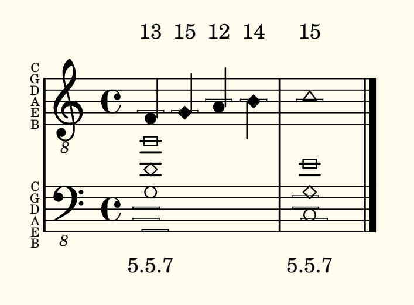

[StaffTab](https://en.wikipedia.org/wiki/Chapman_Stick#Notation) is a notation system developed by Emmett Chapman and Greg Howard for the Chapman Stick. As on piano, music is written on the grand staff and the left hand plays the bottom staff (called the bass staff), while the right hand plays the top staff (called the melody staff). The system incorporates **string**, **fret**, and **finger** information into standard music notation.:

- **String**: a hollow box drawn on the staff line that corresponds to the string on the instrument, as indicated by the labeled lines on the left of the staff. 
- **Finger**: the notehead's *shape* (index = circle, middle = diamond, ring =
  triangle, pinky = square); fill follows duration as usual. 
- **Fret**: a number above the melody staff / below the bass staff

---

## Contents

- [Installation](#installation)
- [Quick start](#quick-start)
- [Writing notes](#writing-notes)
  - [Auto derivation of strings and frets](#auto-derivation-of-strings-and-frets)
  - [The octave convention](#the-octave-convention)
- [Staves](#staves)
- [Tunings](#tunings)
  - [Built-in tunings](#built-in-tunings)
  - [Custom tunings](#custom-tunings)
  - [Printing the tuning name](#printing-the-tuning-name)
- [A note on how much to annotate](#a-note-on-how-much-to-annotate)
- [Examples](#examples)
- [License](#license)

---

## Installation

Download the latest release and unzip it in your desired location.

Add the unzipped folder to Lilypond's path. This can be done in [Frescrobaldi](https://frescobaldi.org/) as follows.

1. Inside Frescobaldi, open the Preferences window by selecting from the top menu: **File -> Preferences**

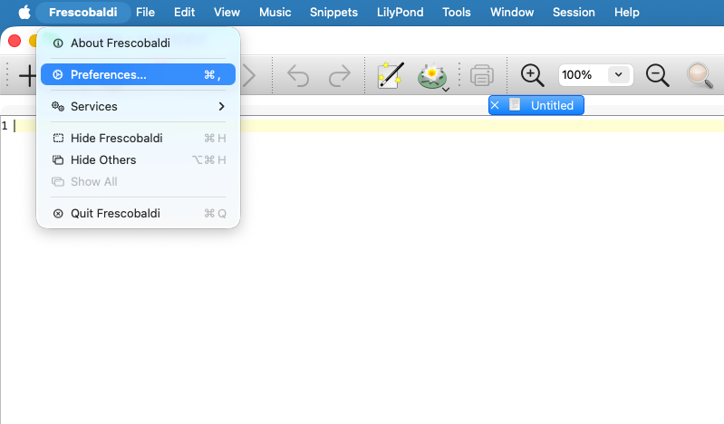

2. Navigate to the **LilyPond** preferences on the left hand side

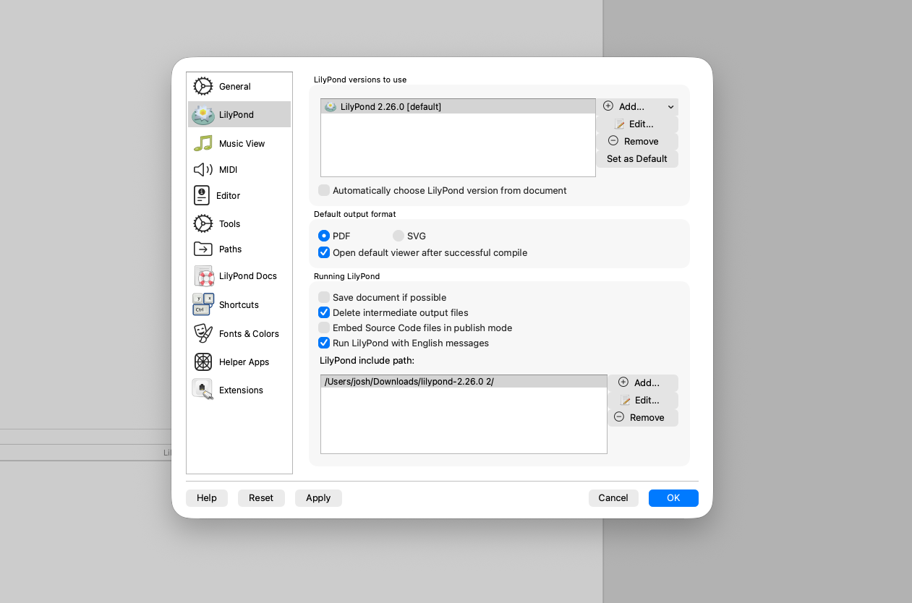

3. On the bottom right, in the **LilyPond Include Path** section, click **+ Add...**, and add the unzipped folder to the path
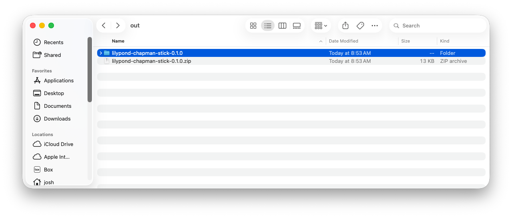

Then, you can create a new file 

## Quick start

See the [Basic Scale and Chord](./examples/basic-scale-and-chord.ly) example:
```lilypond
\version "2.26.0"

\include "lilypond-chapman-stick.ily"

melody = \fixed c {
  \clef "treble_8" 
  \time 4/4
  \key c \major
  
  \tempo ""
  \slurUp
  
  f-1\5 g-2\5 a-1\4 b-2\4 | c'1-3\4
}

bass = \fixed c, {
  \clef "bass_8"
  \time 4/4
  \key c \major
  
  <g=-1\3 b'-4\5 d'-2\4>1 | <c-1\2 g-2\3 e'-4\4>1
  \bar "|."
}

\score {
  \new ChapmanStickStaff \with { stickTuning = \stickTwelveStringMatchedReciprocal } <<
    \new ChapmanStickMelodyStaff \melody
    \new ChapmanStickBassStaff \bass
  >>
}

```

---

## Writing notes

### Basic functionality: recording strings, fingers, and frets

Pitches, finger, and string use standard Lilypond notation (see [pitches](https://lilypond.org/doc/v2.24/Documentation/notation/writing-pitches), [fingerings](https://lilypond.org/doc/v2.26/Documentation/learning/fingering.html), and [string numbers](https://lilypond.org/doc/v2.26/Documentation/notation/common-notation-for-fretted-strings.html) ). Lilypod usually derives fret information from the string and the pitch, but this library also adds an additional operator (`\fr`) to explicitly annotate the fret. Examples of all 3 found below:

|Expression|Meaning|Image|
|---|---|---|
| `c` | C note (specifically C3), with no extra information | 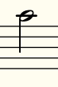
| `c\1 c\2 c\3 c\4 c\5 c\6` | on **string 1,2,3,4**, draws string indicator box on line 3 from the top. | 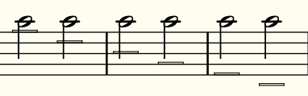
| `c-1 c-2 c-3 c-4` | **finger 1 (index), 2 (middle), 3 (ring), 4 (pinky)**  sets notehead to circle, diamond, triangle, square | 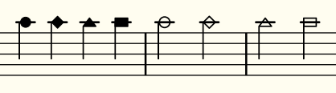
| `c\fr12 c\fr5` | **fret 12, fret 5**. Fret numbers placed above/below the staff. Note that space is allowed between `\fr` and the fret number | 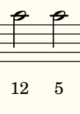
| `c\fr X` or `c\fr0` | the "X" fret fret; `\fr 0 and \fr0` is the same. "X" requires a space between `\fr` and `"X"` | 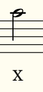
| `c\5-1\fr7` | pin all three explicitly | 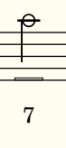
| `<c-1\2\fr1 e'-4\4\fr2 g-2\3\fr3>` | apply all 3 to each note inside a chord | 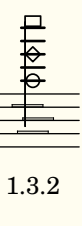
| `\onString 6 { a4 b c d e f g a }` | put a whole run on string 6 | 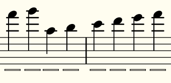

### Auto derivation of strings and frets

When a tuning is configured for a `ChapmanStickStaff`, then when a pitch and a fret is provided, there is enough information to uniquely identify the string the note is played on. Or when a pitch and a string is provided, the fret can be identified. Lilypond-chapman-stick supports automatically displaying the string or the fret, whenever it has enough information to do so. 

```lilypond
\new ChapmanStickStaff \with { 
  % ...tuning etc...

  stickAutoFret = ##t % NOTE: Remove this line to disable auto fret annotations
  stickAutoString = ##t % NOTE: Remove this line to disable auto string annotations
}
```


<table>
<tr>
<td>

```lilypond
score {
  \new ChapmanStickStaff \with { 
    stickTuning = \stickTwelveStringMatchedReciprocal 
    stickAutoFret = ##t % NOTE: Remove this line to disable auto fret annotations
    stickAutoString = ##t % NOTE: Remove this line to disable auto string annotations
    
  } <<
    \new ChapmanStickMelodyStaff {
      \clef "treble_8"
      
      % note: only strings are provided, frets 12, 19, 13, 10 are computed
      a\4 b\5 c\6 d\5
    }
    \new ChapmanStickBassStaff \fixed c,{
      \clef "bass_8"
      %note: only frets are provided, string 2 is computed 
      a\fr14 b\fr16 c\fr5 d\fr7 
      
      % This library will not stop you from entering wrong pitch + string + fret combinations such as below.
      % Explicit fret/string/finger annotations always override derived values
      a\2\fr1
    }
  >>
}
```

</td>
<td>

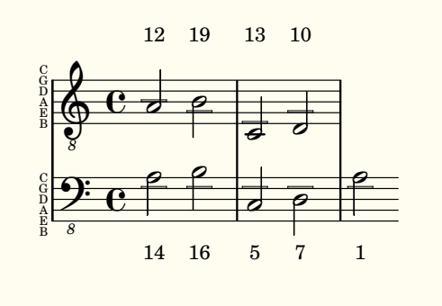

</td>
</tr>
</table>

### The octave convention

Typically in StaffTab, pitches are written one octave higher than they sound. This can be achieved in Lilypond by using transpose blocks:

<table>
<tr>
<td>

```lilypond
melody = \transpose c c' \fixed c {
  \clef treble
 a b c d
}
bass = \transpose c c' \fixed c, {
  \clef bass
 a b c d
}
```
</td>
<td>

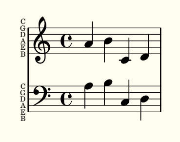 
</td>
</tr>
</table>

However I prefer to be more explicit by using [Octave Clefs](https://en.wikipedia.org/wiki/Clef#Octave_clefs), like this (note the small "8" below the clefs):

<table>
<tr>
<td>

```lilypond
melody = \fixed c {
  \clef "bass_8"
  a b c d 
}
bass = \fixed c, {
  \clef "bass_8"
  a b c d 
}
```
</td>
<td>

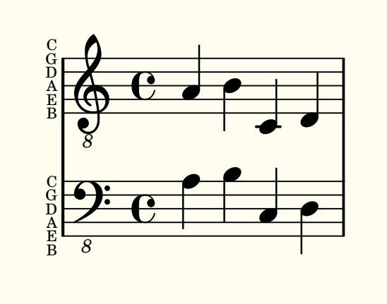 
</td>
</tr>
</table>


---

## Staves

The library gives you a grand-staff group and three single staves. Every staff
`\alias`es `Staff`, so they behave like ordinary staves. They nest in
`StaffGroup` / `PianoStaff` / your own layout, take any `\with` overrides, and
work on their own.

| Context | Use |
|---|---|
| `ChapmanStickStaff` | braces a melody + bass pair into one Stick grand staff; declare the tuning once here |
| `ChapmanStickMelodyStaff` | the melody (top) half — string boxes and frets sit above the staff |
| `ChapmanStickBassStaff` | the bass (bottom) half — string boxes and frets sit below the staff |
| `ChapmanStaff` | a generic staff; you pick the side yourself with `\stickMelody` / `\stickBass` |

The usual setup: declare the tuning on the group, then a melody and a bass staff
inside. The melody/bass staves already know which half they are, so no side
marker is needed:

```lilypond
melody = { \clef "treble_8" \time 4/4 a b c d}
bass = { \clef "bass_8" \time 4/4 a b c d}
\new ChapmanStickStaff \with { stickTuning = \stickTwelveStringClassic } <<
  \new ChapmanStickMelodyStaff \melody
  \new ChapmanStickBassStaff   \bass
>>
```

A single staff works on its own too, just set the tuning directly on it, and add
any overrides you like:

```lilypond
\new ChapmanStickMelodyStaff \with {
  stickTuning = \stickTwelveStringClassic
  \override StaffSymbol.thickness = #1.2 % this line just to demonstrate that user overrides work normally
} \melody
```

If you need a Chapman staff whose side you set by hand (for example nesting in
your own `StaffGroup`), use the generic `ChapmanStaff` with `\stickMelody` or
`\stickBass`:

```lilypond
\new ChapmanStaff \with { stickTuning = \stickTwelveStringClassic \stickMelody } \melody
```

---

## Tunings

A `stickTuning` value can be:

- a **built-in variable**: `stickTuning = \stickTwelveStringClassic` (see the
  tables below)
- a **custom tuning** built with `\makeStickTuning`: `stickTuning = \myTuning`
- an **inline pair** of Scientific Pitch Notation (SPN, i.e. `C#3`, `Eb2` etc) pitch lists (melody then bass,
  `C4` = middle C): `stickTuning = #'(("C4" "G3" ...) ("C1" "G1" ...))`
- a **single side's** SPN list, for a lone staff

Set it on a `ChapmanStickStaff` (shared by both halves) or on an individual
staff.

### Built-in tunings

Select a built-in tuning by its `\stick…` variable. Open strings (or, really, top-fret notes) are in Scientific Pitch Notation (SPN)
(`C4` = middle C).

**10-string** (5 melody + 5 bass):

| Variable | Melody (top→bottom) | Bass (top→bottom) |
|---|---|---|
| `\stickTenStringMatchedReciprocal` | C4 G3 D3 A2 E2 | C1 G1 D2 A2 E3 |
| `\stickTenStringClassic` | D4 A3 E3 B2 F#2 | C1 G1 D2 A2 E3 |
| `\stickTenStringBaritoneMelody` | A3 E3 B2 F#2 C#2 | C1 G1 D2 A2 E3 |
| `\stickTenStringDeepMatchedReciprocal` | Bb3 F3 C3 G2 D2 | Bb0 F1 C2 G2 D3 |
| `\stickTenStringRaisedMatchedReciprocal` | D4 A3 E3 B2 F#2 | D1 A1 E2 B2 F#3 |
| `\stickTenStringFullBaritone` | A3 E3 B2 F#2 C#2 | D1 A1 E2 B2 F#3 |
| `\stickTenStringDualBassReciprocal` | C4 G3 D3 A2 E2 | B0 F#1 C#2 G#2 D#3 |
| `\stickTenStringAlto` | G4 D4 A3 E3 B2 | C2 G2 D3 A3 E4 |
| `\stickTenStringGregHowardExtendedAlto` | A4 E4 B3 F#3 C#3 | C2 G2 D3 A3 E4 |
| `\stickTenStringBobCulbertsonExpandedAlto` | A4 E4 B3 F#3 C#3 | A2 E3 B3 F#4 C#5 |

**12-string** (6 melody + 6 bass):

| Variable | Melody (top→bottom) | Bass (top→bottom) |
|---|---|---|
| `\stickTwelveStringMatchedReciprocal` | C4 G3 D3 A2 E2 B1 | C1 G1 D2 A2 E3 B3 |
| `\stickTwelveStringClassic` | D4 A3 E3 B2 F#2 C#2 | C1 G1 D2 A2 E3 B3 |
| `\stickTwelveStringMatchedReciprocalHighBassFourth` | C4 G3 D3 A2 E2 B1 | C1 G1 D2 A2 E3 A3 |
| `\stickTwelveStringClassicHighBassFourth` | C4 G3 D3 A2 E2 A1 | C1 G1 D2 A2 E3 A3 |
| `\stickTwelveStringDeepMatchedReciprocal` | Bb3 F3 C3 G2 D2 A1 | Bb0 F1 C2 G2 D3 A3 |
| `\stickTwelveStringDualBassReciprocal` | F4 C4 G3 D3 A2 E2 | B0 F#1 C#2 G#2 D#3 A#3 |
| `\stickTwelveStringMirroredFourths` | C4 G3 D3 A2 E2 B1 | E1 A1 D2 G2 C3 F3 |

### Custom tunings

**Build one with `\makeStickTuning`**: give it a name and two SPN pitch lists
(melody then bass), each ordered top line -> bottom. Assign it to
a variable and use it anywhere a tuning is accepted; its name is available to
`\stickTuningName` (see below):

```lilypond
myStickTuning = \makeStickTuning "My Stick Tuning" #'("D4" "A3" "E3" "B2" "F#2" "C#2") 
                                                   #'("C1" "G1" "D2" "A2" "E3" "B3")

melody = {\clef "treble_8" a1}
bass = {\clef "bass_8" a1}
\score {
  \new ChapmanStickStaff \with { stickTuning = \myStickTuning } <<
    \new ChapmanStickMelodyStaff \melody
    \new ChapmanStickBassStaff   \bass
  >>
}
```

Open strings must be valid scientific pitch notation (a letter, optional `#`/`b`,
and an octave number) — `\makeStickTuning` rejects anything else, including a
missing octave like `"C"`.

**Inline, without a variable**: for a one-off, give `stickTuning` the pair of
lists directly, or a single side's list on a lone staff:

```lilypond
\new ChapmanStickStaff \with {
  stickTuning = #'(("D4" "A3" "E3" "B2" "F#2" "C#2")   %% melody, top → bottom
                   ("C1" "G1" "D2" "A2" "E3" "B3"))    %% bass,   top → bottom
} <<
  \new ChapmanStickMelodyStaff \melody
  \new ChapmanStickBassStaff   \bass
>>

\new ChapmanStickMelodyStaff \with {
  stickTuning = #'("D4" "A3" "E3" "B2" "F#2" "C#2")
} \melody
```

### Printing the tuning name

`\stickTuningName` yields a tuning's name as markup - handy in a title or
instrument name. Pass the tuning as a Scheme value with `#` (a built-in variable
or a `\makeStickTuning` one):

```lilypond
\new ChapmanStickStaff \with {
  stickTuning    = \myStickTuning
  instrumentName = \markup { "Chapman Stick in " \stickTuningName #myStickTuning }
} << … >>
```

---

## A note on how much to annotate

People have differing philosophies. It's perfectly valid to have every string, finger, and fret annotated. Others may find it's clearer to only annotate when there's a change in a string, or where a non-obvious finger/pinky/string is used, and to leave the rest as implied. 

---

## Examples

The [`examples/`](./examples) directory has complete scores:

- [`basic-scale-and-chord.ly`](./examples/basic-scale-and-chord.ly) — the
  quick-start snippet above
- [`ode-to-joy.ly`](./examples/ode-to-joy.ly) — *Ode to Joy* for a 12-string
  matched-reciprocal Stick, showing strings, finger shapes, explicit frets, and
  both staves braced.

Compile one with `src` on the include path (or from your installed location):

---

## License

Public domain — dedicated under [CC0 1.0](LICENSE.txt). Use it however you like.
